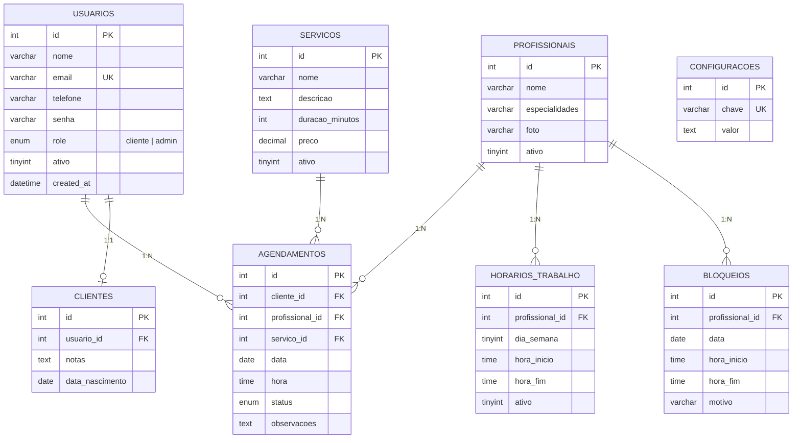

# Banco de Dados — Barbearia Turetta

## Diagrama ER

## Dicionário de Dados

### `usuarios`
Tabela central de todos os usuários do sistema (clientes e admins).

| Coluna | Tipo | Descrição |
|---|---|---|
| id | INT PK AI | Identificador único |
| nome | VARCHAR(150) | Nome completo |
| email | VARCHAR(255) UK | E-mail (login) |
| telefone | VARCHAR(20) | Telefone com DDD |
| senha | VARCHAR(255) | Hash bcrypt |
| role | ENUM | `cliente` ou `admin` |
| ativo | TINYINT | 1 = ativo, 0 = inativo |

### `agendamentos`
Registros de todos os agendamentos realizados.

| Coluna | Tipo | Descrição |
|---|---|---|
| cliente_id | INT FK | Usuário que agendou |
| profissional_id | INT FK | Barbeiro responsável |
| servico_id | INT FK | Serviço escolhido |
| data | DATE | Data do agendamento |
| hora | TIME | Horário de início |
| status | ENUM | `confirmado`, `concluido`, `cancelado`, `nao_compareceu` |

### Índices Importantes

| Tabela | Índice | Colunas | Justificativa |
|---|---|---|---|
| agendamentos | idx_profissional_data | profissional_id, data | Query mais frequente: disponibilidade |
| agendamentos | idx_data | data | Dashboard: agendamentos do dia |
| agendamentos | idx_cliente | cliente_id | Área do cliente: meus agendamentos |
| horarios_trabalho | uk_profissional_dia | profissional_id, dia_semana | Unicidade: 1 registro por profissional+dia |
